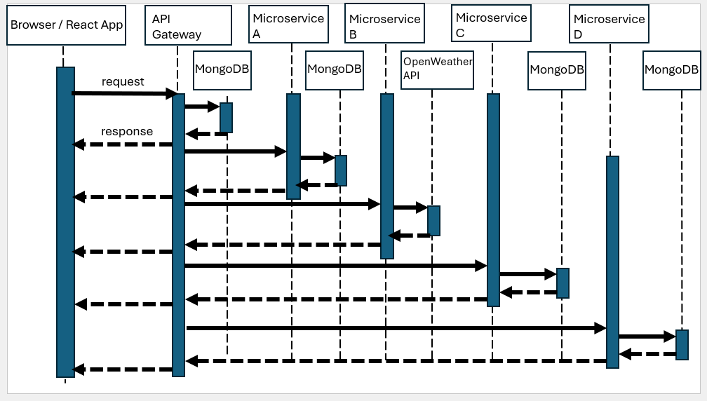

# About
This is an Expense Tracker MERN application which helps users keep track of their spending on different expenses. It uses React for frontend and NodeJS and Express for backend. Data is stored in MongoDB. The application is also built using four independent microservices. You can read more about microservice architecture style here:
https://learn.microsoft.com/en-us/azure/architecture/guide/architecture-styles/microservices


## 1. Main features
The application allows the user to create an account and log in.

After log in the user can create or add an expense by filling out a form.

The user can edit an expense or delete it. 

There is also a Help feature on the Navigation Menu which users can refer to to get detailed instructions on how to use the application effectively. It also provides them with an email address and phone number to call if they run into issues with the app.

The application also allows the user to log out.

```

```

## 2. Microservices

Microservice A was provided by my Teammate, Hana. It provides a way to convert the expenses from USD to other currencies (MXN pesos at the moment) but could be expanded to other currencies in the future.

Microservice B allows the user to check the weather for a specific valid US zip code in case they want to venture out and go shopping.
It uses the <a href="https://openweathermap.org/api">Open Weather API</a> to fetch the local weather for a valid zip code.

Microservice C allows the user to visualize a Bar/Line Chart of their monthly expenses so that they can visually see how they spend their money on groceries, entertainment, or other categories.

Microservice D allows the user to view their user profile settings and preferences (name, email, gender, location, zipcode, occupation). In the future this information can be used to generate personalized recommendations for the user.

```

```

## 3. UML Diagram 



## 4. How to run

After cloning, run cd server\expense tracker and create .env file with the following contents appropriately updated:

```
PORT=XXXX
PORT2=XXXX
PORT3=XXXX
PORT4 = XXXX
PORT5 = XXXX
MONGODB_CONNECT_STRING='XXX'
API_KEY = 'XXX'
```

Open a terminal and run the following commands: 

```
cd client
npm install
npm run dev
```

Open another terminal and run:

```
cd server\expense_tracker
npm install
npm start
```

## 5. Deployment Instructions

You may have to tweak a few things with environment variables and URLs when running locally.

To deploy on Render:

Create a Static Site on Render.
Root directory: client
Build command:

```
npm install && npm run build
```

Publish directory:

dist (for Vite)

Add Redirect/Rewrite rule for React Router:

```
Source: /*
Destination: /index.html
Action: Rewrite
```

Add .env.production in client:
```
VITE_API_BASE_URL=https://<your-backend-service>.onrender.com
```

Deploy backend Web Service

Create a Web Service on Render.
Root directory: server/expense_tracker
Start command:
```
npm install && node server.js
```

Ensure the following:

Use process.env.PORT in code.
Add MongoDB URI and secrets in Render Environment Variables.
Modify CORS in backend as indicated below (taken from mjs files)

```
const PORT = process.env.PORT || 3000;

app.use(cors({
  origin: ['http://localhost:5173', 'https://expense-tracker-application-da78.onrender.com'],
  credentials: true
}));
```

Connect frontend and backend

```

const API_BASE = import.meta.env.VITE_API_BASE_URL;
axios.post(`${API_BASE}/login`, { email, password });

```


